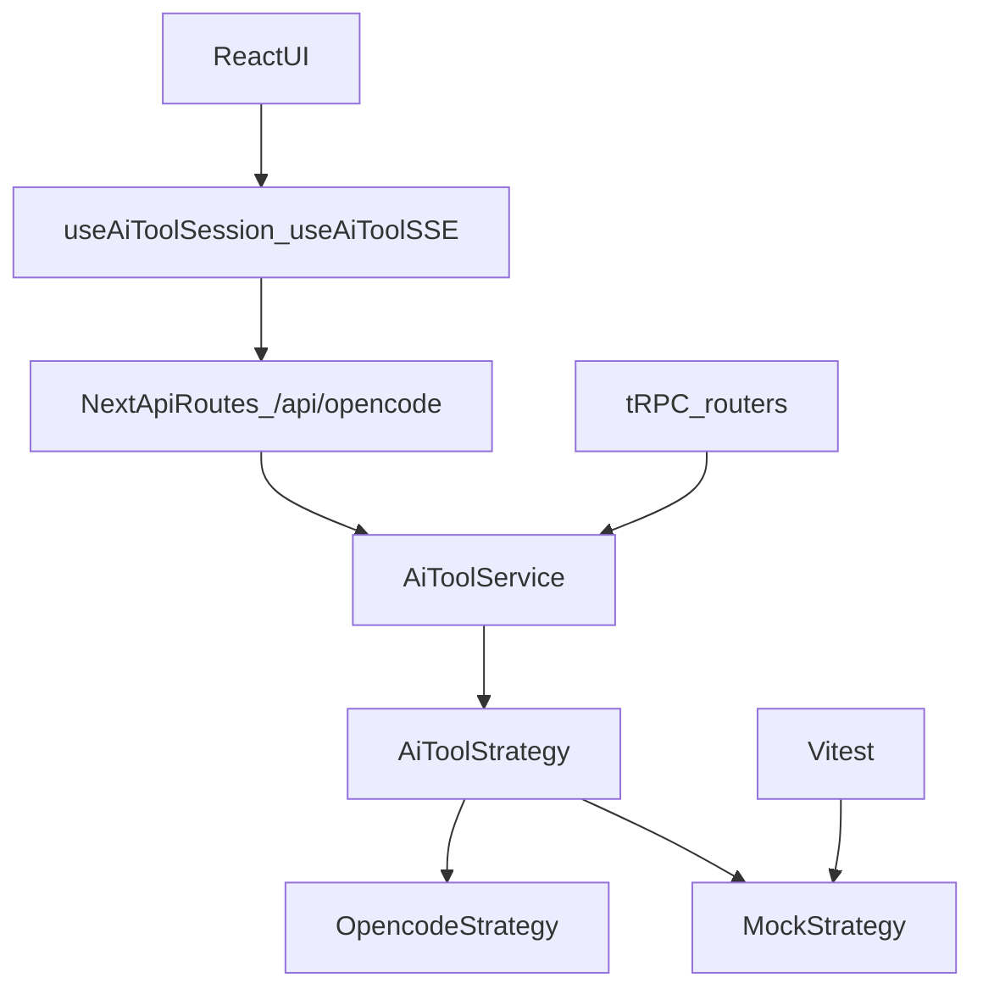

## Goals (what “done” means)

- **Type safety**: UI and server code do not depend on `@opencode-ai/sdk` types directly; no `@ts-expect-error` in Opencode flows; stable domain types for messages/events.
- **Strategy abstraction**: Opencode is one implementation of a **tool-server strategy interface** so it’s mockable and extensible.
- **Tests**: Vitest tests that mock the strategy and verify the **data flow boundaries** (session bootstrap, message transforms, SSE forwarding, ticket-session persistence call chain).
- **UI**: Keep current layout, but align **design language** (typography, spacing, surfaces, code/tool-call presentation) to Opencode using BTCA-derived guidance.
- **Naming & structure**: Components/pages follow consistent React/Next conventions; reduce duplicate “Opencode plumbing” across API routes, tRPC, and server modules.
- **Dependencies**: Update safely and verify via `check`, `typecheck`, `test`, then `format` (no build).

## Constraints / guardrails

- Keep existing HTTP entrypoints stable (e.g. [`src/app/api/opencode/*`](src/app/api/opencode/)) to avoid breaking the UI.
- Avoid `next build` during the rework; validate via `bun run check`, `bun run typecheck`, `bunx vitest`, and manual dev smoke.
- Prefer incremental refactors with short-lived compatibility shims (re-exports / wrapper hooks) so changes are reviewable.

## What exists today (relevant findings)

- **Three Opencode access paths**:
  - Next API routes: [`src/app/api/opencode/*`](src/app/api/opencode/)
  - tRPC router: [`src/server/api/routers/opencode.ts`](src/server/api/routers/opencode.ts)
  - Ticket integration module: [`src/server/tickets/opencode.ts`](src/server/tickets/opencode.ts)
- **Client hooks depend on SDK types**: [`src/hooks/useOpencodeSSE.ts`](src/hooks/useOpencodeSSE.ts), [`src/hooks/useOpencodeStream.ts`](src/hooks/useOpencodeStream.ts)
- **Message transformation is duplicated / leaky**:
  - Server transform uses SDK `Part[]`: [`src/server/opencode/message-utils.ts`](src/server/opencode/message-utils.ts)
  - Client polling hook reconstructs partial SDK `Message` and has `@ts-expect-error`: [`src/hooks/useOpencodeStream.ts`](src/hooks/useOpencodeStream.ts)

## Target architecture (strategy + domain types)

### Core idea

Create a small **domain model** (messages, parts, session status, events) and a single **`AiToolStrategy` interface** that returns domain types. Opencode becomes an adapter that maps SDK types → domain types. All higher layers (tRPC/routes/hooks/components) only speak the domain.

## Phase plan

### Phase 0 — Baseline + BTCA UI research

- Run BTCA queries (Opencode tech) to extract UI conventions:
  - `btca ask -t opencode -q "Describe Opencode UI design system: typography, spacing, surfaces, message list, tool-call display, code blocks"`
  - `btca ask -t opencode -q "How does Opencode present tool calls (pending/running/completed/error) and streaming updates?"`
- Inventory all Opencode call sites (already partially mapped) and list what each layer needs from the strategy.

### Phase 1 — Introduce domain types + strategy interface (no behavior change)

Create a new server feature module:

- [`src/server/ai-tools/types.ts`](src/server/ai-tools/types.ts): domain types like:
  - `AiSession`, `AiSessionStatus`, `AiMessage`, `AiPart` (text/reasoning/tool/file/step-finish), `AiToolCall`, `AiEvent`
- [`src/server/ai-tools/strategy.ts`](src/server/ai-tools/strategy.ts): `AiToolStrategy` interface, shaped strictly by current needs:
  - `health()`, `listSessions()`, `createSession()`, `getMessages()`, `prompt()`, `promptAsync()`, `getStatus()`, `getDiff()`, `getTodos()`, `subscribeEvents()`
- [`src/server/ai-tools/opencode/opencode-strategy.ts`](src/server/ai-tools/opencode/opencode-strategy.ts): Opencode adapter that:
  - uses existing [`src/lib/opencode-client.ts`](src/lib/opencode-client.ts) initially
  - maps SDK responses and events into domain types (single mapping layer)
- [`src/server/ai-tools/index.ts`](src/server/ai-tools/index.ts): factory `getAiToolStrategy()`.

### Phase 2 — Move “Opencode logic” into a service layer

Add:

- [`src/server/ai-tools/service.ts`](src/server/ai-tools/service.ts): functions that implement “what the app does” using `AiToolStrategy`:
  - `getFullSession(sessionId)` (messages/status/diff/todos/toolCalls)
  - `startSessionForTicket(ticket)`
  - `askTicket(session, prompt)`

Then refactor call sites to use the service:

- [`src/server/api/routers/opencode.ts`](src/server/api/routers/opencode.ts) becomes thin orchestration calling the service.
- Next API routes under [`src/app/api/opencode/`](src/app/api/opencode/) call the same service/strategy (keep URLs stable).
- Ticket module [`src/server/tickets/opencode.ts`](src/server/tickets/opencode.ts) becomes either:
  - a thin wrapper around `ai-tools/service.ts`, or
  - is renamed to `tickets/ai-assistant.ts` with a temporary re-export from the old path.

### Phase 3 — Client hooks switch to domain types (remove SDK types from UI)

- Replace `useOpencodeSSE` / `useOpencodeStream` outputs with domain types:
  - introduce [`src/hooks/useAiToolSSE.ts`](src/hooks/useAiToolSSE.ts) and [`src/hooks/useAiToolSession.ts`](src/hooks/useAiToolSession.ts)
  - keep `useOpencodeSSE` as a wrapper (temporary) to avoid large PR blast radius
- Remove duplicated transform code by reusing one domain-level transformer.
- Remove `@ts-expect-error` and casts in [`src/hooks/useOpencodeStream.ts`](src/hooks/useOpencodeStream.ts) (or delete it if SSE is the only supported mode).

### Phase 4 — Tests (Vitest) with a mock strategy

Set up testing infra:

- Add `vitest` scripts and config (path alias `@/*`, separate `node` vs `jsdom` where needed).
- Add `@testing-library/react` + `@testing-library/jest-dom` for hook/component tests if we cover UI flows.

Add mocks:

- [`src/server/ai-tools/mock/mock-strategy.ts`](src/server/ai-tools/mock/mock-strategy.ts) implements `AiToolStrategy` with deterministic in-memory data.

Core tests (data-flow focused):

- **Service tests**: `getFullSession()` composes and transforms correctly (tool call extraction, timestamps, status mapping).
- **SSE route test**: [`src/app/api/opencode/events/route.ts`](src/app/api/opencode/events/route.ts) streams bootstrap + forwards only session-relevant events (inject mock strategy + synthetic async iterator).
- **Ticket flow test**: verify the chain “create/reuse session → promptAsync/prompt → persist session ID” by injecting:
  - mock `AiToolStrategy`
  - a minimal DB façade (so we don’t need real sqlite in unit tests)

### Phase 5 — UI rework (Opencode design language)

Based on BTCA findings, adjust:

- **Global tokens**: [`src/styles/globals.css`](src/styles/globals.css) (font, code styling, borders, surfaces, spacing rhythm).
- **UI primitives**: [`src/components/ui/`](src/components/ui/) for `Card`, `Badge`, `Tabs`, `ScrollArea`, `Input`, etc.
- **Chat surfaces**:
  - [`src/app/admin/chats/_components/`](src/app/admin/chats/_components/): message list, tool-call display, session sidebar
  - ticket chat tabs under [`src/app/_components/`](src/app/_components/)

Deliverable: “feels like Opencode” while keeping your current layout.

### Phase 6 — Component/page cleanup + naming conventions

- Add a short conventions doc: `docs/conventions/react.md` covering:
  - file naming (`kebab-case.tsx` vs `PascalCase.tsx`), export style, folder conventions (`_components` only for route-local)
- Rename ambiguous components for clarity:
  - e.g. `ticket-agent-tab` → `ticket-agent-chat-tab` (and ensure it matches what the tab actually does)
- Move truly reusable components out of [`src/app/_components/`](src/app/_components/) into [`src/components/`](src/components/) (route-local stays in `_components`).

### Phase 7 — Dependency updates (safe, verified)

- Update dependencies with Bun (to match repo reality + `bun.lock`).
- Add testing deps for Vitest.
- Verification checklist after each bump:
  - `bun run check`
  - `bun run typecheck`
  - `bunx vitest`
  - manual smoke via `bun run dev` (quick critical paths)
- Final step: `bun run format`.

### Phase 8 — Repo structure proposal (incremental migration path)

Proposed shape (minimal churn, feature-oriented):

- `src/server/ai-tools/` (strategy, domain, opencode adapter, mocks)
- keep `src/server/tickets/` for provider sync logic; move “AI assistant for ticket” into a clearly named module
- gradually reduce `src/lib/opencode-*` by moving feature-specific utilities under `ai-tools/` and leaving `src/lib` for cross-cutting helpers

Success criteria for the restructure:

- there is exactly **one** place that imports `@opencode-ai/sdk` (the opencode strategy adapter)
- UI imports only app/domain types, not SDK types

## Execution order recommendation

Do Phases 1–4 first (types/strategy/tests), then UI/naming, then deps updates last. That keeps risk low and makes “nothing breaks” verifiable at every step.